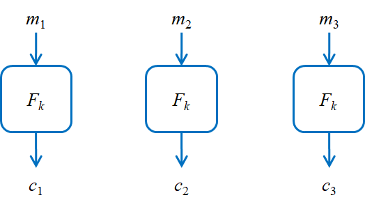
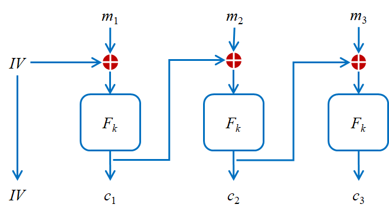
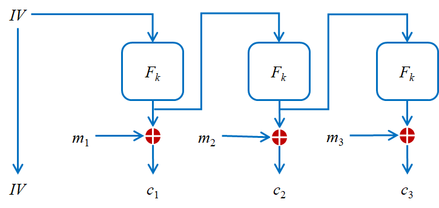
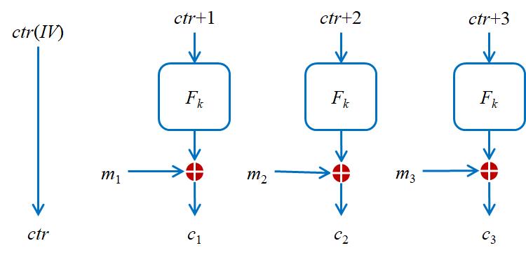
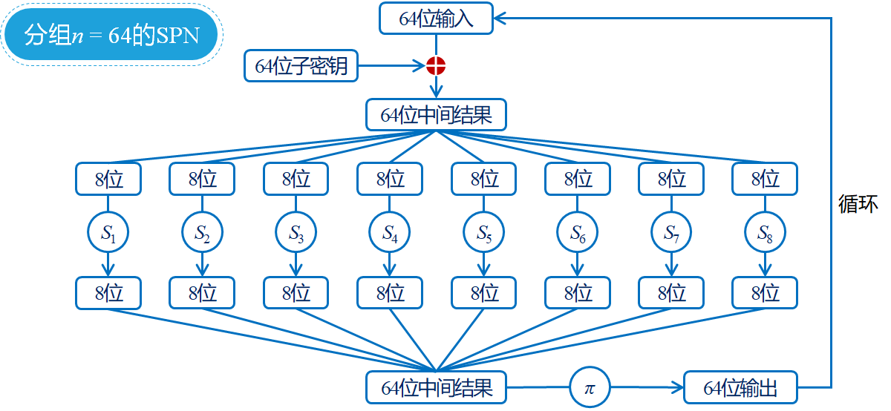
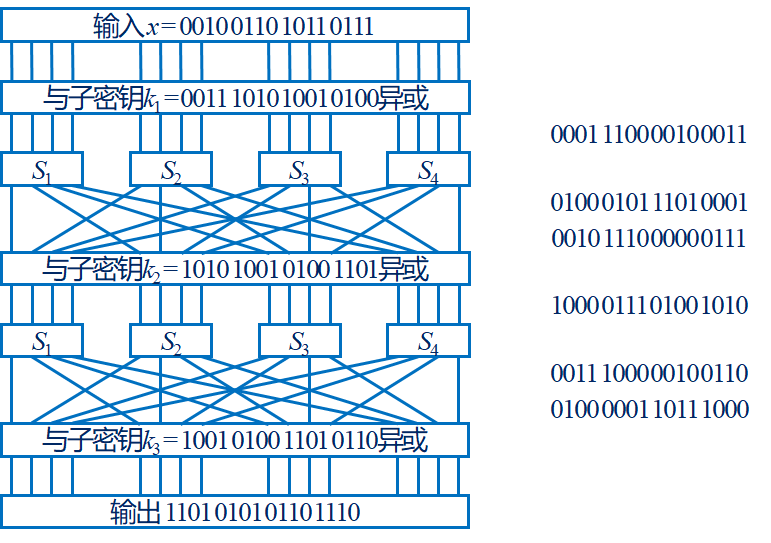
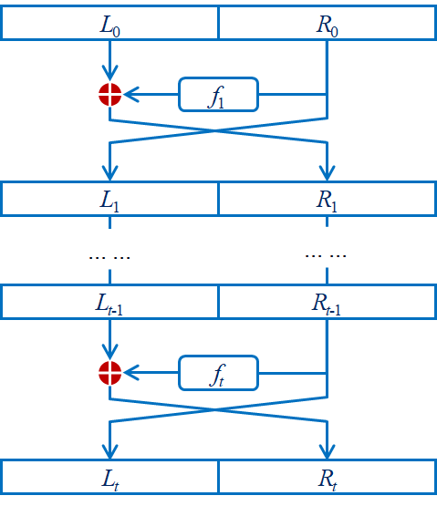

# 现代密码学

> 2021 级南开大学计算机学院（研究生课）密码学期末重点
> 使用前请先阅读[免责声明](https://github.com/Youggls/Cryptography/blob/master/README.md)

## 1 现代密码学基本原则

### 1.1 现代密码学的三个基本原则

定义、假设、证明

- 形式化的**定义**：包括精确的数学模型和安全性定义
  - 安全加密的定义：如果没有敌手能够从密文中计算任何关于明文的函数，则加密方案是安全的
  - 任何安全定义的通用形式：如果特定的敌手不能完成特定的攻破，则给定任务的一个密码学方案是安全的

- 精确的**假设**依赖：所构造方案的安全性依赖于某个假设，该假设需要精确且无歧义

- 严格的安全**证明**：符合上述两个原则的基础上，具备严格的安全证明

考**填空题**

## 2 无条件安全/计算安全

### 2.1 完善保密

- 威胁模型-攻击场景
  - 唯密文攻击（KPA）：敌手只能观察到一个或多个密文，并试图确定相应的明文
  - 已知明文攻击（KPA）：敌手已知一个或多个使用相同密钥加密的明文/密文对，并试图确定其他密文对应的明文
  - 选择明文攻击（CPA）：敌手能够选择明文，并得到相应的密文，并试图确定目标密文对应的明文
  - 选择密文攻击（CCA）：敌手能够选择密文得到相应的明文，并试图确定其他密文对应的明文
  
- 完善保密：无论敌手是否已知有关明文的先验信息，密文都不应泄露任何有关明文的其他信息（唯密文攻击，单个密文）
  - 计算能力：无限，无条件安全
  - 攻击场景：唯密文攻击
  - 背景知识：明文的概率分布
  
- 完善保密数学语言：
  - 一个对称密钥加密体制可以由明文空间 $\mathcal M$，密文空间 $\mathcal C$ 和算法 $(Gen, Enc, Dec)$ 组成
    - $Gen$ 密钥生成算法：输入安全参数 $\lambda$ 输出密钥 $k$，$k\larr Gen(\lambda)$
    - $Enc$ 加密算法：输入密钥 $k$ 和明文 $m\in \mathcal M$ 输出密文 $c$，$c\larr Enc_k(m)$
    - $Dec$ 解密算法：输入密钥 $k$ 和密文 $c$ 输出明文 $m$ 或错误，$m:=Dec_k(c)$
  - 完善保密的正确定义：存在一个明文空间为 $\mathcal M$ 密文空间为 $\mathcal C$ 的加密方案 $\Pi=(Gen,Enc,Dec)$，如果对 $\mathcal C$ 上任意的概率分布，任意明文 $m \in \mathcal M$ 和任意密文 $c \in \mathcal C(Pr[C=c]>0)$ 均有 $Pr[M=m|C=c]=Pr[M=m]$。则称 $\Pi$ 是完善保密加密。
  
- 一次一密

  - 定义

    - 明文空间、密文空间和密钥空间均为 $\{0, 1\}^l$
    - 密钥生成算法 $Gen$ 从 $\mathcal K = \{0, 1\}^l$ 中根据均匀分布选择一个二进制比特串作为密钥
    - 加密算法 $Enc$ ：给定密钥 $k\in \{0,1\}^l$ 和明文 $c\in \{0,1\}^l$，算法被定义为 $Enc_k(m)=m\oplus k$
    - 解密算法 $Dec$ ：给定密钥 $k\in \{0,1\}^l$ 和明文 $c\in \{0,1\}^l$，算法被定义为 $Dec_k(c)=c\oplus k$
    - 正确性：对所有的 $m\in \mathcal M$ 和由 $Gen$ 输出的 $k$ 均有 $Dec_k(Enc_k(m))=(m\oplus k)\oplus k=m\oplus k \oplus k = m$

  - 证明是完善保密加密：

    - 选定 $\mathcal M$ 上的任意纷纷内部，任意一个明文 $m\in \mathcal M$ 和密文 $c \in \mathcal C$，$\Pi$ 均有

      $Pr[C=c|M=m]=Pr[M\oplus K=c | M=m]=Pr[m\oplus K=c]=Pr[K=m\oplus c]=2^{-l}$

    - 根据全概率公式可得

      $Pr[C=c]=\sum_{m \in \mathcal M} Pr[C=c|M=m]\cdot Pr[M=m]=2^{-l}\sum_{m\in \mathcal M}\cdot Pr[M=m]=2^{-l}$

    - 故有 $Pr[C=c|M=m]=Pr[C=c]$，根据之前的引理，定理得证。

  - 一次一密下的移位加密也是完善保密

- 一次一密的缺陷

  如果存在多个由相同密钥加密所得的一次一密方案的密文，明文消息 $m$ 和 $m'$ 用同样一个密钥 $k$ 进行加密，敌手得到 $c=m\oplus k\ \ \ c'=m'\oplus k$

  那么可以计算出 $c\oplus c'=(m\oplus k)\oplus (m' \oplus k) = m \oplus m'$

  虽然两条消息看起来不重要，但是泄露了关于明文消息的信息

  如果消息明文具有一定特殊分布，获得足够多由相同密钥加密所得的密文，可以攻破一次一密。

###  2.2 渐进方法的计算安全如何定义

- 计算安全：我们希望敌手不能在合理的时间内以任何合理的成功概率攻破方案。

- 渐进安全：

  - 希望通过敌手的运行时间以及成功概率视为某个参数（安全参数 $\lambda$）的函数，对一个给定密码学的方案的安全性进行量化，仅当安全参数 $\lambda$ 足够大时才保证安全。
  - 一般形式：如果每个**概率多项式时间**敌手只能以**可忽略的概率**攻破一个方案，那么该方案是安全的

- 概率多项式时间：算法的时间复杂度为多项式级

  称 $t_A: \{0,1\}^* \rarr \mathbb N$ 为算法 A 的时间复杂度，如果对于任意输入 $x\in \{0,1\}^*$，算法 A 此前好在 $t_A(x)$ 个步骤后终止。

  如果 $t_A=poly(|A|)$，那么称 A 为多项式时间算法，如果 A 同时是一个概率算法，那么 A 是概率多项式时间算法。

### 2.3 例题

- 例 1：什么条件下的维吉尼亚（置换、移位）加密是完善保密加密

  一次一密下

- 例 2：存在完善保密的公钥加密方案吗？

  不存在，即使是一次一密

- 例 3：从计算能力的角度，我们一般考虑怎样的敌手？、

  概率多项式时间（PPT）

- 例 4：如果 $\epsilon(\lambda)$ 是可忽略函数，那么对于任意多项式 $poly$，$poly(\lambda)\cdot\epsilon(\lambda)$ 也是可忽略函数？

  是可忽略函数。反之如果 $poly(\lambda)\cdot\epsilon(\lambda)$ 不是，两者肯定也都不是。

## 3 归约证明

### 3.1 例题

- 例 1：”方案 Y 的安全性基于假设 X“是什么意思？

  答：如果假设 X 成立，那么方案 Y 安全。或如果方案 Y 不安全，那么假设 X 不成立

- 例 2：如何用规约的方法证明方案 Y 的安全性？

  答：利用破解方案 Y 的有效算法构造令假设 X 不成立的有效算法，用于说明”如果方案 Y 不安全，那么假设 X 不成立“，然而假设 X 是成立的，所以方案 Y 安全。

## 4 伪随机性

### 4.1 什么是伪随机性

伪随机性指的是比特串的分布特性：$D$ 为长度 $l$ 的串的分布，如果长度为 $l$ 的串均匀分布与分布 $D$ 在概率多项式时间内不可区分，则称 $D$ 有伪随机性。

### 4.2 选择明文攻击的安全性

给定对称密钥加密体制 $\Pi=(Gen,Enc,Dec)$ 和敌手 $\mathcal A$，其选择铭文攻击条件下的不可区分性 (IND-CPA) 实验定义为：

- CPA 不可区分性实验 $Privk^{cpa}_{\mathcal A,\Pi}(\lambda)$

  - 挑战者运行 $Gen(\lambda)$ 生成一个密钥

  - 挑战者给定输入 $\lambda$ 给 $\mathcal A$，$\mathcal A$ 可以访问预言机 $Enc_k(\cdot)$，输出一对长度相等的消息 $m_0$ 和 $m_1$ 给挑战者

  - 挑战者选择一个随机比特 $b\larr\{0,1\}$，计算挑战密文 $c\larr Enc_k(m_b)$ 并发送给 $\mathcal A$

  - $\mathcal A$ 可以继续访问 $Enc_k(\cdot)$，输出一个比特 $b'$

  - 如果 $b=b'$ 实验输出 1，否则输出 0

- 定义：如果对于所有概率多项式时间敌手 $\mathcal A$，存在一个可忽略函数 $negl$ 使得：

  $Pr[Privk^{cpa}_{\mathcal A,\Pi}(\lambda)=1]\leq1/2+negl(\lambda)$

  则称 $\Pi$ 具备选择明文攻击条件下的不可区分性（IND-CPA）

  - 如果方案是确定加密($Enc$ 是确定算法)，必然不满足 IND-CPA

    敌手在产生不同的 $m_0$ 和 $m_1$ 后，计算得到 $c_0\larr Enc_k(m_0)$ 和 $c_1\larr Enc_k(m_1)$

    在得到挑战密文 $c$ 之后，进行比较，如果 $c=c_0$ 输出 0，否则输出 1

    此时概率为 1

### 4.3 伪随机函数

#### 4.3.1 伪随机数生成器

伪随机数生成器是一个确定多项式时间算法，用于将一个均匀随机选取的长度为 $\lambda$ 的段种子扩展为长度为 $l(\lambda)$ 的伪随机输出。

定义：确定多项式时间算法 $G:\{0,1\}^{\lambda}\rarr\{0,1\}^{l(\lambda)}$ 是伪随机数生成器，如果其满足

- 扩展性：对于每个 $\lambda$ 而言，满足 $l(\lambda) > \lambda$

- 伪随机性：对于所有概率多项式时间区分器 $D：\{0,1\}^{\lambda}\rarr\{0,1\}$ 而言，存在一个可忽略函数 $negl$ 使得：

  $|Pr(D(r)=1)-Pr(D(G(s)))=1|\leq negl(\lambda)$

  其中 $r$ 在 $\{0,1\}^{l(\lambda)}$ 上均匀随机选取，种子 $s$ 在 $\{0,1\}\lambda$ 上均匀随机选取

#### 4.3.2 伪随机函数

令 $F:\{0,1\}^*\times\{0,1\}^*\rarr \{0,1\}^*$ 是有效的、长度保留的（$|F_k(x)|=|x|$）、带密钥的函数，称 $F$ 是一个伪随机函数，如果其满足对所有概率多项式时间区分器 $\mathcal D$ 而言存在一个可忽略函数 $negl$ 使得

 $|Pr[\mathcal D^{F_k(\cdot)}(\lambda)=1]-Pr[\mathcal D^{f(\cdot)}(\lambda)=1]|\leq negl(\lambda)$

其中，$k$ 在 $\{0,1\}^\lambda$ 上均匀随机选取，函数 $f$ 在 $Func_k=\{f|f:\{0,1\}^\lambda\rarr \{0,1\}^\lambda\}$ 上均匀随机选取

#### 4.3.3 伪随机函数：IND-CPA 方案构造

消息长度为 $\lambda$ 的定长对称密钥加密方案 $\Pi=(Gen,Enc,Dec)$

- $F$ 是一个伪随机函数
- 密钥生成算法：均匀随机地选取 $k\larr \{0,1\}^\lambda$ 作为密钥并输出
- 加密算法：给定密钥 $k\in\{0,1\}^\lambda$ 和明文 $m\in \{0,1\}^\lambda$，均匀随机地选择 $r\larr \{0,1\}^\lambda$，定义输出：$Enc_k(m)=r||F_k(r)\oplus m$
- 解密算法：给定密钥 $k\in\{0,1\}^\lambda$ 和密文 $c=r||s$，定义输出：$Dec_k(c)=F_k(r)\oplus s$

证明：如果 $F$ 是一个伪随机函数，那么方案 $\Pi$ 具备选择明文攻击下的不可区分性

- 令 $\mathcal A$ 为一个 PPT 敌手，定义 $\epsilon(\lambda)=Pr[Privk^{cpa}_{\mathcal A,\Pi}(\lambda)=1]-1/2$
- 构造一个区分器 $\mathcal D^{\mathcal O(\cdot)}$，其可以访问函数的预言机 $\mathcal O:\{0,1\}^\lambda\rarr \{0,1\}^\lambda$
  - 运行 $\mathcal A$，无论何时 $\mathcal A$  向加密预言机发出关于 $m$ 的查询，用下述方法应答：
    - 均匀随机地选择 $r\larr \{0,1\}^\lambda$，询问获得 $s'\larr\mathcal O(r)$
    - 返回密文 $r||s'\oplus m$
  - 当 $\mathcal A$ 处获得一对消息 $m_0, m_1\in\{0,1\}^\lambda$ 时，随机选择一个比特 $b$
    - 均匀随机地选择  $r\larr \{0,1\}^\lambda$，询问获得 $s'\larr \mathcal O(r)$
    - 返回挑战密文 $r||s'\oplus m_b$
  - $\mathcal A$ 最终输出 $b'$，如果 $b=b'$，则输出 1，否则输出 0
- 构造方案 $\Pi'=(Gen',Enc',Dec')$，使用均匀随机选取的函数 $f\in Func_\lambda$ 代替方案 $\Pi$ 中 $Enc$ 的 $F_k$，其余构造均相同。
- 在实验 $Privk^{cpa}_{\mathcal A,\Pi'}(\lambda)$ 中
  - $\mathcal A$ 最多向加密预言机询问 $q(\lambda)$ 次，$q$ 为多项式
  - 关于 $m$ 询问的应答为 $r||f(r)\oplus m$ 其中均匀随机选择 $r\larr \{0,1\}^\lambda$
  - 令 $r_c$ 为生成挑战密文 $r_c||f(r_c)\oplus m_b$ 时的随机串
  - 如果 $r_c$ 曾被加密预言机用作回答，则 $\mathcal A$ 可以正确区分挑战密文，该事件发生的概率最多为 $q(\lambda)/2^\lambda$
  - 如果 $r_c$ 未曾被加密预言机用作回答，则 $f(r_c)\oplus m_b$ 完全随机，在这种情况下，$\mathcal A$ 可以正确区分挑战密文的概率为 $1/2$
  - 所以 $Pr[Privk^{cpa}_{\mathcal A,\Pi'}=1]\leq q(\lambda)/2^\lambda\cdot1+1\cdot1/2=1/2+q(\lambda)/2^\lambda$
- 观察给定不同预言机 $\mathcal O$ 时 $\mathcal D$ 的输出，证明 $\mathcal D$ 的有效性
- 当预言机为一个在 $Func_\lambda$ 上均匀随机选取的函数 $f$ 时
  - $\mathcal A$ 在所见内容的分布与在其实验 $Privk^{cpa}_{\mathcal A, \Pi'}(\lambda)$ 中完全相同
  - 此时 $Pr[\mathcal D^{f(\cdot)}(\lambda)=1]=Pr[Privk^{cpa}_{\mathcal A, \Pi'}=1]\leq1/2+q(\lambda)/2^\lambda$
- 当预言机为一个伪随机函数 $F_k$ 时，其中 $k$ 在 $\{0,1\}^\lambda$ 上均匀选取
  - $\mathcal A$ 在所见内容分布与其在实验 $Privk^{cpa}_{\mathcal A, \Pi}(\lambda)$ 中完全相同（其所见密文均为 $Enc_k(\cdot)$ 加密所得）
  - 此时 $Pr[\mathcal D^{F_k(\cdot)}(\lambda)=1]=Pr[Privk^{cpa}_{\mathcal A,\Pi}(\lambda)=1]=1/2+\epsilon(\lambda)$
- 因此，$|Pr[\mathcal D^{F_k(\cdot)}(\lambda)=1]-Pr[\mathcal D^{f(\cdot)}(\lambda)]|\geq \epsilon(\lambda)-q(\lambda)/2^\lambda$
- 然而并不存在有效的 $\mathcal D$，所以 $\epsilon(\lambda)-q(\lambda)/2^\lambda$ 可忽略
- 又因为可忽略 $q(\lambda)/2^\lambda$，所以 $\epsilon(\lambda)$ 可忽略，定理得证

#### 4.3.4 伪随机置换与伪随机函数

- 定义：令 $F:\{0,1\}^*\times\{0,1\}^*\rarr\{0,1\}^*$ 是有效的带密钥的置换，称 $F$ 是一个**伪随机置换**如果其满足对所有**概率多项式时间**区分器 $\mathcal D$ 而言存在一个可忽略函数 $negl$，使得：

  $|Pr[\mathcal D^{F_k(\cdot)}=1]-Pr[\mathcal D^{f(\cdot)}(\lambda)]|\leq negl(\lambda)$

  其中 $k$ 在 $\{0,1\}^\lambda$ 上均匀随机选取， $f$ 是从 $\lambda$ 比特串置换的集合中均匀随机选择的

- **强伪随机置换**定义：令 $F:\{0,1\}^*\times\{0,1\}^*\rarr\{0,1\}^*$ 是有效的带密钥的置换，称 $F$ 是一个**伪随机置换**如果其满足对所有**概率多项式时间**区分器 $\mathcal D$ 而言存在一个可忽略函数 $negl$，使得：

  $|Pr[\mathcal D^{F_k(\cdot),F^{-1}_k(\cdot)}=1]-Pr[\mathcal D^{f(\cdot),f^{-1}(\cdot)}(\lambda)]|\leq negl(\lambda)$

  其中 $k$ 在 $\{0,1\}^\lambda$ 上均匀随机选取， $f$ 是从 $\lambda$ 比特串置换的集合中均匀随机选择的

#### 4.3.5 利用伪随机函数/置换构造的加密模式

- ECB 模式

  

  - 确定性加密
  - 无法满足多次加密不可区分性，更不满足 IND-CPA

- CBC 模式

  

  - $F$ 是一个伪随机置换，CBC 模式满足 IND-CPA
  - 改变了前面 IND-CPA 构造中密文长度为明文两倍的缺陷
  - CBC 模式加密需要以此进行，无法实现并行处理

- OFB 模式

  

  - $F$ 可以是一个伪随机函数，OFB 模式满足 IND-CPA
  - OFB 模式中大量独立于明文的伪随机流可以在预处理阶段计算

- CTR 模式

  

  - $F$ 可以是一个伪随机函数，CTR 模式满足 IND-CPA
  - CTR 模式可以实现随机访问（只解密第 i 个分组）

### 4.4 例题

- 例 1：$DES$ 扩展函数 $E$ 被定义为输入 $s=b_1b_2...b_{32}$，输出 $E(s)=b_{32}b_1b_2...b_{32}b_{32}b_1$，那么 $E$ 是伪随机数生成器吗？为什么（此时 $\lambda=32$ 扩展因子 $l(\lambda)=3\lambda/2$

  |      |      |      |      |      |      |
  | :--: | :--: | :--: | :--: | :--: | :--: |
  |  32  |  1   |  2   |  3   |  4   |  5   |
  |  4   |  5   |  6   |  7   |  8   |  9   |
  |  8   |  9   |  10  |  11  |  12  |  13  |
  |  12  |  13  |  14  |  15  |  16  |  17  |
  |  16  |  17  |  18  |  19  |  20  |  21  |
  |  20  |  21  |  22  |  23  |  24  |  25  |
  |  24  |  25  |  27  |  27  |  28  |  29  |
  |  28  |  29  |  30  |  31  |  32  |  1   |

  解答思路：观察 $s$ 均匀随机选取时 $E(s)$ 的输出 $w$ 与等长均匀随机串 $r$ 的差别，然后构造区分器 $D$，可以以不忽略的概率区分 $w$ 与 $r$

  - 48 比特串 $w$ 的第 1 比特等于第 47 比特，第 2 比特等于第 48 比特，共有 16 个特定比特重复
  - 如果均匀选择一个 48 比特的串，特定有 16 个特定位置的比特重复的概率最多为 $2^{-16}(2^{-\lambda/2})$
  - 设区分器 $D$，输入为 48 比特的串，检查对应位置比特是否都相等，如果都相等那么输出 1，否则输出 0
  - 这样 $|Pr[D(E(s))=1]-Pr[D(r)=1]|\geq1-2^{-\lambda/2}$，$E$ 显然不是伪随机数生成器

- 例 2：当初始向量 $IV$ 均匀随机选取时，$CBC$ 、$OFB$、$CTR$ 模式满足 $IND-CPA$ 吗？（下图是 $CBC$ 模式）

  

  满足，但固定初始向量不满足

## 5 分组密码

分组密码是强伪随机置换在实践上的启发式构造，其可用于构造加密方案、消息鉴别码、认证协议等

分组密码是一个有效的带密钥的置换 $F$

- $F:\{0,1\}^n\times\{0,1\}^\lambda\rarr \{0,1\}^n$
- $n$ 为分组长度，$\lambda$ 为密钥长度

分组密码所要求的主要特征是其行为“像”一个随机选择的置换

### 5.1 雪崩效应

- 输入的微小改变必然会导致输出的巨大改变
- 要利用”混淆与扩散“的设计思想使之满足雪崩效应

### 5.2 分组密码的典型结构（SPN & Feistel）

#### 5.2.1 SPN

代替-置换网络

- 可被是为混淆与分散的直接实现，逐轮执行

- 每一轮中间结果与当前轮子密钥进行混合（异或）

- “混淆”

  - 将每个 $f_i$ 作为一个 $S$ 盒（$ S$ 表示 Substitution）$S_i:\{0,1\}^l\rarr\{0,1\}^l$
  - $S$ 盒的构造不依赖于密钥 $k$

- “分散”

  - 用置换（Permutation）$\pi$ 对 $\{S_i\}$ 的所有输出进行洗牌（Shuffle）
  - 其中 $\pi:\{1,2,...,n\}\rarr \{1,2,...,n\}$

- 最后结果与当前轮子密钥进行混合（异或）---- 白化（whitening）

- SPN-单轮结构

  

- SPN 整体结构

  假设一个 SPN 的分组 $n=16$，$S$ 盒的位数 $l=4$，$S_i$ 和 $\pi$ 的构造分别为

  | $x$  | $0$  | $1$  | $2$  | $3$  | $4$  | $5$  | $6$  | $7$  | $8$  | $9$  | $A$  | $B$  | $C$  | $D$  | $E$  | $F$  |
  | :--: | :--: | :--: | :--: | :--: | :--: | :--: | :--: | :--: | :--: | :--: | :--: | :--: | :--: | :--: | :--: | :--: |
  | $S$  | $E$  | $4$  | $D$  | $1$  | $2$  | $F$  | $B$  | $8$  | $3$  | $A$  | $6$  | $C$  | $5$  | $9$  | $0$  | $7$  |

  | $x$  | $1$  | $2$  | $3$  | $4$  | $5$  | $6$  | $7$  | $8$  | $9$  | $10$ | $11$ | $12$ | $13$ | $14$ | $15$ | $16$ |
  | :--: | :--: | :--: | :--: | :--: | :--: | :--: | :--: | :--: | :--: | :--: | :--: | :--: | :--: | :--: | :--: | :--: |
  | $\pi$ | $1$ | $5$ | $9$ | $13$ | $2$ | $6$ | $10$ | $14$ | $3$ | $7$ | $11$ | $15$ | $4$ | $8$ | $12$ | $16$ |

  - 密钥位数为 32，第 $r$ 轮的子密钥 $k_r$ 为从第 $4r-3$ 位开始的 16 个连续比特
    - 设密钥 $k=0011\ 1010\ 1001\ 0100\ 1101\ 0110\ 0011\ 1111$
    - 子密钥 $k_1=0011\ 1010\ 1001\ 0100$
    - 子密钥 $k_2=1010\ 1001\ 0100\ 1101$
    - 子密钥 $k_3=1001\ 0100\ 1101\ 0110$
  - 设明文 $x=0010\ 0110\ 1011\ 0111$ 进行两轮加密
  
  
  
  
  
- SPN 功能需求：

  - SPN 在设计时的原则之一：$S$ 盒的可逆性
  - $S$ 盒必须是双射
  - 从而保证每一轮都是可逆的
  - 从而保证给定输出和密钥可以确定输入：$F$ 是带密钥的置换
  - 假设 $F$ 是一个由 SPN 定义的带密钥的函数，该网络中所有的 $S$ 盒都是双射，则不考虑密钥编排方法以及轮数，对任意选择的 $k$，$F_k$ 都是置换

- SPN 安全需求

  - SPN 在设计时的原则之二：雪崩效应
  - 以下两个特性可令 SPN 满足雪崩效应
    - $S$ 盒要满足改变 $S$ 盒的**单个输入比特**就能改变 $S$ 盒的至少两个输出比特
    - 扩散置换要满足任何 $S$ 盒的输出比特都被传递到下一轮中**不同**的 $S$ 盒中

#### 5.2.2 Feistel 网络

- 与 SPN 比较 
  - 相同点：具有 $S$ 盒、密钥编排、混合盒置换等步骤
  - 不同点：$S$ 盒不需要可逆

>  Feistel 网络是从用非可逆的组成部分构造出可逆函数的一种方法

- 在 Feistel 网络中

  - 输入长度为 $n$，被分为等长的两半，左半部分为 $L_0$，右半部分为 $R_0$

  - 在第 $i$ 轮中：
    - 轮函数为 $f_i:\{0,1\}^{n/2}\rarr\{0,1\}^{n/2}$，由子密钥 $k_i$ 定义
    - 输入为 $L_{i-1}$ 和 $R_{i-1}$，输出为 $L_i:=R_{i-1}$ 和 $R_i:=L_{i-1}\oplus f_i(R_{i-1})$

  - $t$ 轮后输出 $L_t$ 和  $R_t$
  - $t$ 轮 Feistel 网络

  

- Feistel 网络的可逆性：

  - 已知子密钥 $k_i$，给定第 $i$ 轮的输出 $L_i$ 和 $R_i$ 可计算该轮的输入 $L_{i-1}$ 和 $R_{i-1}$
  - $R_{i-1}:=L_i,L_{i-1}=R_i\oplus f_i(R_{i-1})$
  - 命题：假设 $F$ 是一个由 Feistel 网络定义的带密钥的函数，不考虑函数 $\{f_i\}$ 和轮数，对任意选择的 $k$，$F_k$ 都是置换

### 5.3 例题

- 例 1：什么是雪崩效应

  输入微小的变化，导致输出很大的变化（出判断填空题）

- 例 2：给定轮函数和初值，计算若干论后 Feistel 网络的输出

## 6 MAC 与 Hash

### 6.1 消息鉴别码

#### 6.1.1 数据完整性

数据的完整性保证了接收方接受的信息来源于发送方，且未遭受篡改，即使主动的敌手控制了通信信道

#### 6.1.2 定义

- 一个**消息鉴别码**方案可以由概率多项式时间算法 $(Gen,Mac,Vrfy)$ 组成：

  - $Gen$ 密钥生成算法：输入安全参数 $\lambda$，输出密钥 $k(|k|\geq\lambda)$

  - $Mac$ 标记生成算法：输入密钥 $k$ 和明文 $m\in\{0,1\}^*$，输出标记  $t$

    $t\larr Mac_k(m)$

  - $Vrfy$ 校验算法：输入密钥 $k$ 和标记 $t$，输出比特位 $b$

    $b:=Vrfy_k(m,t)$

    如果 $b=1$，证明消息有效，否则无效

  - 如果该方案是正确的，则对于所有的 $m\in\{0,1\}^*$ 和由 $Gen$ 输出的 $k$ 均有

    $Vrfy_k(m,Mac_k(m))=1$

#### 6.1.3 安全性

- 消息鉴别码：安全性

  - 威胁模型：允许敌手访问一个 $MAC$ 预言机 $Mac_k(\cdot)$，敌手可以提交任何消息明文 $m$ 给预言机，得到相应的标记 $t\larr Mac_k(m)$
  - 安全目标：
    - ”存在性不可伪造“
    - 敌手无法伪造任何（未向 $Mac$ 预言机询问过的）消息明文的有效标记
    - 暂时不考虑重放（replay）

- 消息鉴别码：安全性定义

  - 给定消息鉴别码方案 $\Pi=(Gen,Mac,Vrfy)$ 和敌手 $\mathcal A$，定义实验：

  - 消息鉴别码伪造实验 $Mac-forge_{\mathcal A,\Pi}(\lambda)$

    - 挑战者运行 $Gen(\lambda)$ 生成一个密钥 $k$
    - 挑战者给定输入 $\lambda$ 给 $\mathcal A$，$\mathcal A$ 可以访问预言机 $Mac_k(\cdot)$，最后输出 $m$ 和 $t$，其向预言机询问过的消息集合为 $\mathcal Q$
    - 如果 $Vrfy_k(m,t)=1$ 且 $m\notin \mathcal Q$，则实验输出 1，否则输出 0

  - 定义：如果对于所有**概率多项式时间**敌手 $\mathcal A$，存在一个可忽略的函数 $negl$ 使得

    $Pr[Mac-forge_{\mathcal A,\Pi}=1]\leq negl(\lambda)$

    则称 $\Pi$ 是适应性选择消息攻击下存在性不可伪造的，或者说是安全的。

- 重放攻击

  重放攻击（Replay Attack）：敌手复制并发送某一方之前发出的一条消息和 MAC 标记

  - 消息鉴别码机制不能阻止重放攻击：无状态的机制都不能阻止
  - 一般来说，重放攻击的防御都在与应用相关（由应用规定消息内容是否合法），例如：序列号、时间戳

#### 6.1.4 消息鉴别码的安全构造

- 安全 MAC-定长构造

  消息长度为 $\lambda$ 的定长消息鉴别码方案 $\Pi=(Gen,Mac,Vrfy)$

  - $F:\{0,1\}^\lambda\rarr \{0,1\}^\lambda$ 是一个伪随机函数

  - 密钥生成算法 $Gen$：均匀随机地选择 $k\larr\{0,1\}^\lambda$ 作为密钥输出

  - 标记生成算法 $Mac$：给定密钥 $k\in \{0,1\}^\lambda$ 和消息明文 $m\in \{0,1\}^\lambda$，定义输出

    $Mac_k(m)=F_k(m)$

  - 校验算法 $Vrfy$：给定密钥 $k\in\{0,1\}^\lambda$、消息明文 $m\in\{0,1\}^\lambda$ ，以及标记 $t\in \{0,1\}^\lambda$，判断 $t?=F_k(m)$，如果成立输出 1；否则输出 0

- 定理：如果 $F$ 是一个伪随机函数，那么定长方案 $\Pi$ 是适应性选择消息攻击下存在性不可伪造的

  证明：规约，利用敌手 $\mathcal A$ 构造一个区分器 $\mathcal D$，使得如果 $\mathcal A$ 可以攻击成功，则 $\mathcal D$ 可以区分预言机 $\mathcal O$ 是伪随机函数还是随机选取的函数

  - 令 $\mathcal A$ 为一个 PPT 敌手，定义 $\epsilon(\lambda)=Pr[Mac-forge_{\mathcal A, \Pi}(\lambda)=1]$
  - 构造一个区分器 $\mathcal D^{\mathcal O(\cdot)}$，其可以访问函数的预言机 $\mathcal O:\{0,1\}^\lambda\rarr\{0,1\}^\lambda$
    - 运行 $\mathcal A$，无论何时 $\mathcal A$ 向加密预言机发出关于 $m$ 的询问，用下述方法应答：
      - 询问预言机获得 $t\larr\mathcal O(m)$，将 $t$ 返回
      - 当 $\mathcal A$ 运行结束时，输出一对 $m$ 和  $t$
      - 询问预言机获得 $t'\larr\mathcal O(m)$
      - 如果 $t'=t$，则输出 1，否则输出 0
    - 构造方案 $\Pi'=(Gen',Mac',Vrfy')$，使用均匀随机选取的函数 $f\in Func_\lambda$ 代替方案 $\Pi$ 的 $Mac$ 中的 $F_k$，其余均相同
    - 在实验 $Mac-forge_{\mathcal A,\Pi'}$ 中
      - 因为对于任意 $m\notin \mathcal Q$，在看来，$t=f(m)$ 是在 $\{0,1\}^\lambda$ 上均匀选取的
      - 所以 $Pr[Mac-forge_{\mathcal A,\Pi'}(\lambda)=1]=1/2^\lambda$
    - 观察给定不同预言机 $\mathcal O$ 时 $\mathcal D$ 的输出，证明 $\mathcal D$ 的有效性
    - 当预言机为一个在 $Func_\lambda$ 上均匀随机选取的函数 $f$ 时：
      - $\mathcal A$ 在所见内容的分布与其在实验 $Mac-forge_{\mathcal A,\Pi'}(\lambda)$ 中完全相同
      - $Pr[\mathcal D^{f(\cdot)}(\lambda)=1]=Pr[Mac-forge_{\mathcal A,\Pi'}(\lambda)=1]=1/2^\lambda$
    - 当预言机为一个伪随机函数 $F_k$ 时，其中 $k$ 在 $\{0,1\}^\lambda$ 上均匀选取
      - $\mathcal A$ 在所见内容的分布与其在实验 $Mac-forge_{\mathcal A,\Pi}(\lambda)$ 中完全相同（其所见标记均由 $Mac_k(\cdot)$ 生成）
      - 此时 $Pr[\mathcal D^{F_k(\cdot)}(\lambda)=1]=Pr[Mac-forge_{\mathcal A, \Pi}(\lambda)=1]=\epsilon(\lambda)$
    - 因此 $|Pr[\mathcal D^{F_k(\cdot)}(\lambda)=1]-Pr[\mathcal D^{f(\cdot)}(\lambda)=1]|\geq \epsilon(\lambda)-1/2^\lambda$
    - 然而并不存在有效的 $\mathcal D$，所以 $\epsilon(\lambda)-1/2^\lambda$ 可忽略
    - 又因为 $1/2^\lambda$ 可忽略，所以 $\epsilon(\lambda)$ 可忽略，定理得证

### 6.2 Hash

散列函数（Hash Function）是将任意长度的字符串压缩成短的定长摘要的函数 $H(x):\{0,1\}^*\rarr\{0,1\}^l$

#### 6.2.1 定义

一个散列函数可以由概率多项式时间算法 $(Gen,H)$ 组成：

- $Gen$ 密钥生成算法：输入安全参数 $\lambda$，输出密钥 $s\ (|s|>\lambda)$

  $s\larr Gen(\lambda)$

- 对 $H$ 输入密钥 $s$ 和一个比特串 $x\in \{0,1\}^*$，输出一个比特串 $H^s(x)\in\{0,1\}^{l(\lambda)}$，其中 $l$ 为多项式

#### 6.2.2 抗碰撞

给定散列函数 $\Pi=(Gen,H)$ 和敌手 $\mathcal A$，定义实验：

散列函数碰撞实验 $Hash-coll_{\mathcal A,\Pi}(\lambda)$

- 挑战者运行 $Gen(\lambda)$ 生成一个密钥 $s$
- 挑战者给定输入 $s$ 给 $\mathcal A$，最后输出 $x$ 和 $x'$ （如果 $\Pi$ 定长，则 $x$ 和 $x'$ 等长）
- 如果 $x\neq x'$ 且 $H^s(x)=H^s(x')$，则实验输出 1；否则输出 0

定义：如果对于所有概率多项式时间敌手 $\mathcal A$，存在一个可忽略函数 $negl$ 使得：

​							$Pr[Hash-coll_{\mathcal A, \Pi}(\lambda)=1]\leq negl(\lambda)$

则称 $\Pi$（或者简称为 $H$ 或  $H^s$）是抗碰撞的

#### 6.2.3 安全级别

对于散列函数 $H^s$ 而言，抗碰撞是一个较强的安全性需求，典型的安全级别三种：

- 抗碰撞
- 抗第二原相：如果给定输入 $s$ 和 $x$，对于 PPT 敌手而言，找到 $x'$ 满足 $x\neq x'$ 且 $H^s(x')=H^s(x)$ 是不可行的
- 抗原相：如果给定输入 $s$ 和 $y=H^s(x)$，对于 PPT 敌手而言，找到 $x'$ 满足 $H^s(x')=y$ 是不可行的

### 6.3 例题

- 例 1**（必考！）** 如果 $(Gen,h)$ 是一个抗碰撞散列函数，那么由 $H^s(x):=h^s(h^s(x))$ 定义的 $(Gen,H)$ 一定抗碰撞吗，为什么？

  一定抗碰撞，证明如下

  - 假设 $H$ 不抗碰撞，那么：$\exists x\neq y,\ H^s(x)=H^s(y)$
  - 那么有：$h^s(h^s(x))=h^s(h^s(y))$
  - 如果 $h^s(x)= h^s(y)$，那么 $(x,y)$ 是 $h$ 的一个碰撞对
  - 如果 $h^s(x)\neq h^s (y)$，让 $x'=h^s(x),\ y'= h^s(y)$，那么有 $h^s(x')=h^s(y')$，故 $(x',y')$ 为 $h$ 的一个碰撞对
  - 又因为已知 $h^s$ 为抗碰撞的，故假设不成立，原命题 $H^s$ 抗碰撞成立！

## 7 群论

### 7.1 群及其定义

- 定义 群（Group）是由集合 $\mathbb G$ 和其上的二元运算 $\circ$ 构成的代数系统 $(\mathbb G,\circ)$，满足以下性质：
  - 封闭性：对于任意 $g,h\in \mathbb G$，有 $g\circ h\in \mathbb G$
  - 结合律：对于任意 $g_1,g_2,g_3\in \mathbb G$，有 $(g_1\circ g_2)\circ g_3=g_1\circ(g_2\circ g_3)$
  - 有单位元：存在单位元 $e\in \mathbb G$，对任意 $g\in \mathbb G$，有 $e\circ g=g\circ e=g$
  - 有逆元： 对任意 $g\in\mathbb G$，存在逆元 $h\in\mathbb G$，使得 $g\circ h=h\circ g=e$
- 如果群 $\mathbb G$ 满足交换律，则被称为阿贝尔群或者交换群，
  - 交换律：对于任意 $g,h\in \mathbb G$，有 $g\circ h=h\circ g$
- 定义：有限群 $\mathbb G$ 的阶（order）是 $\mathbb G$ 中元素的个数，即 $|\mathbb G|$

### 7.2 模加群和模乘群

#### 7.2.1 模加群

- 子群：如果 $\mathbb G$ 是一个群 $\mathbb H\subset\mathbb G$，且 $\mathbb H$ 关于 $\mathbb G$ 上的运算构成群，则称 $\mathbb H$ 为 $\mathbb G$ 的子群
  - 例：$(\mathbb Z,+)$ 是一个阿贝尔群，单位元为 0，$g$ 的逆元为 $-g$，$(\text{even number}, +)$ 是其子群，而 $(\mathbb Z,\cdot)$ 不是群
- $\mathbb Z_N$ 表示一个模 $N$ 的加法群
  - 二元运算 $+$ 被定义为集合 $\{0,1,...,N-1\}$ 上的加法模运算
  - $a+b$ 被定义为 $a+b\ \text{mod}\ N$

#### 7.2.2 模乘群

- 模乘：通常我们用 $\mathbb Z^*_N$ 表示一个模 $N$ 的乘法群

  - 对于任意 $a,b\in\mathbb Z^*_N$，$ab$ 被定义为 $ab\ \text{mod}\ N$

  - 显然满足**结合律**、**交换律**

  - **单位元**为 1

  - 当且仅当 $\text{gcd}(a,N)=1$ 时（$\text{gcd}$ 为最大公约数函数），$a$ 模 $N$ 可逆，所以集合被定义为：

    ​					$\mathbb Z^*_N=\{a\in\{1,2,...,N-1\}\ |\ \text{gcd}(a,N)=1\}$

  - 满足**封闭性**：

    - 如果存在 $c=ab\ \text{mod}\ N$ 且 $a,b\in \mathbb Z^*_N$ 而 $C\notin \mathbb Z^*_N$
    - 那么存在素数 $p>1$ 使得 $p|\text{gcd}(c,N)$，又 $ab=kN+c$，故 $p|ab$，即 $p|a$ 或 $p|b$
    - 与 $\text{gcd}(a,N)=1$ 或 $\text{gcd}(b,N)=1$ 矛盾，所以 $c\in \mathbb Z^*_N$

  - 故 $\mathbb Z^*_N$ 为阿贝尔群

- 由于 $\mathbb Z^*_N$ 被定义为 $\{a\in\{1,2,...,N-1\}\ |\ \text{gcd}(a,N)=1\}$，所以其阶为 $\phi(N)$

  - $\phi(N)$ 为欧拉函数，$\phi(N)$ 表示 $\{1,2,...,N-1\}$ 中与 $N$ 互素的元素个数

  - 定理：设 $N=\Pi_ip_i^{e_i}$，其中 $\{p_i\}$ 为互不相同的素数，且 $e_i\geq1$，则

    ​						$\phi(N)=\Pi_ip_i^{e_{i-1}}(p_i-1)$

  - 推论：对于任意 $N>1,\ a\in\mathbb Z^*_N$，有 $a^{\phi(N)}=1\ \text{mod}\ N$

    - **费马小定理**：如果 $p$ 为素数，且 $a\in\{1,2,...,p-1\}$，有 $a^{p-1}=1\ \text{mod}\ p$

#### 7.2.3 循环群

- 设 $\mathbb G$ 为阶为 $m$ 的有限群

  - 对于任意元素 $g\in\mathbb G$，考虑集合 $\{g^0,g^1,...\}$
  - 该集合包含的元素个数 $i$ 称为 $g$ 的阶，由于 $g^m=1=g^0$，所以 $i\leq m$
  - 如果 $i=m$，那么该集合包含了 $\mathbb G$ 的所有元素
    - $g$ 被称为 $\mathbb G$ 的生成元
    - 如果 $\mathbb G$ 是有生成元的，那么 $\mathbb G$ 被称为循环群
  - $\mathbb Z_8$ 为一个循环群， $3$ 是生成元而 $2$ 不是
  - $\mathbb Z_7^*$ 是一个循环群，$3$ 是生成元
  - 

- 重要定理

  - 命题：设 $\mathbb G$ 是阶为 $q$ 的有限群，若 $g\in \mathbb G$ 的阶为 $i$，则 $i|q$

  - 推论：如果 $\mathbb G$ 是一个阶为素数 $p$ 的群，则 $\mathbb G$ 为循环群，且除其中单位元外的元素均为 $\mathbb G$ 的生成元

  - 定理：如果 $p$ 为素数，则 $\mathbb Z_p^*$ 为循环群（充分而不必要）

#### 7.2.4 中国剩余定理

- 同构

  令群 $\mathbb G,\ \mathbb H$ 的群运算分别为 $\circ_\mathbb G$ 和 $\circ_\mathbb H$，有函数 $f:\mathbb G\rarr\mathbb H$ 满足：

  - 对任意的 $g_1,g_2\in\mathbb G$，可得 $f(g_1\circ_\mathbb G g_2)=f(g_1)\circ_\mathbb H f(g_2)$
  - 如果 $f$ 是单射/满射/双射，则被称为从 $\mathbb G$ 到 $\mathbb H$ 的单同态/满同态/同构
  - 如果存在一个从 $\mathbb G$ 到 $\mathbb H$ 的同构，则称这两个群同构，记作 $\mathbb G \sim \mathbb H$

- 群的叉乘运算：

  - 群 $\mathbb G_1$ 和 $\mathbb G_2$ 的叉乘结果为 $\mathbb G_1 \times \mathbb G_2$，其中元素为有序对 $(g_1,g_2)$，其中 $g_1\in \mathbb G_1$ 和 $g_2 \in \mathbb G_2$
  - 叉乘结果 $\mathbb G_1 \times \mathbb G_2$ 是一个群

- 定理：设 $N=pq$，其中 $p$ 和 $q$ 互素，则：

  存在同构函数 $f(x):=(x\ \text{mod}\ p,x\ \text{mod}\ q)$ 使得 $\mathbb Z_N$ 与 $\mathbb Z_p\times \mathbb Z_q$ 同构， $\mathbb Z^*_N$ 与 $\mathbb Z^*_p \times \mathbb Z^*_q$ 同构

  - 群元素之间的对应关系可以简记为 $x\lrarr(x\ \text{mod}\ p, x\ \text{mod}\ q)$
  - 定理可以扩展至 $N=a_1a_2...a_n$ ，其中 $a_1,a_2,...,a_n$ 两两互素

- 同构函数 $f$ 可高效求逆 $f^{-1}$：给定 $f(x)=(x_p,x_q)$ 求 $x$

  - 令 $1_p\lrarr(0,1),\ 1_q\lrarr(0,1)$，有 $(x_p,x_q)\lrarr x=(1_p\cdot x_p,1_q\cdot x_q)\ \text{mod}\ N$
    - 利用广义欧几里得除法，可得 $X$ 和 $Y$，满足 $Xp+Yq=1$
    - 易得 $1_p=Yq\ \text{mod}\ N,\ 1_q=Xp\ \text{mod}\ N$
  - 例：设 $p=5,\ q=7,\ N=35$，将 $(4,3)$ 转换到 $\mathbb Z_{35}^*$ 中对应的元素
    - 根据广义欧几里得除法，得 $3\cdot5-2\cdot7=1$
    - 所以 $1_p=-2\cdot7\ \text{mod}\ 35=21$，$1_q=3\cdot5\ \text{mod}\ 35=15$
    - 所以，$(4,3)\lrarr 4\cdot 21+3\cdot 15\ \text{mod}\ 35=24$

#### 7.2.5 二次剩余及其性质

- 合数模 $N$ 的平方根求解：给定 $a$ 求解满足 $x^2=a\ \text{mod}\ N$ 的 $x\in\mathbb Z_N^*$

  - 如果合数 $N=pq$ 分解形式已知，其中 $p$ 和 $q$ 为互不相等的奇素数
  - 存在同构函数 $f(x)=(x\ \text{mod}\ p,x\ \text{mod}\ q)$，使得 $\mathbb Z_N^*$ 与 $\mathbb Z_p^*\times\mathbb Z_q^*$ 同构
  - 可以高效求解一个平方根 $x$
    - 计算 $f(a)=(a_p,a_q)$
    - 计算 $a_p$ 模 $p$ 的一个平方根 $x_p$ 和 $a_q$ 模 $q$ 的一个平方根 $x_q$
    - 计算 $f^{-1}(x_p,x_q)=x$
  - 易求得 $a$ 的全部 4 个平方根

- 引理：设 $N=pq$，其中 $p,q$ 为不相等的奇素数，如果给定 $x,x'$，其满足 $x^2=x'^2\ \text{mod}\ N$，且 $x\neq \pm x'$，则 $N$ 的分解问题可以被**高效求解**

  证明：

  - 设 $x\lrarr (x_p,x_q)$，则 $x'\lrarr(-x_p,x_q)$ 
  - 所以，$x+x'\ \text{mod}\ N \lrarr (x_p,x_q)+(-x_p,x_q)=(0,2x_q\ \text{mod}\ q)$
  - 所以，通过计算得到 $\text{gcd}(N,x+x')=p$，其为 $N$ 的一个因子

- 二次剩余：
  - 定义：在数论中，特别在同余理论中，一个整数 $X$ 对另一个整数 $p$ 的二次剩余指 $X^2$ 除以 $p$ 得到的余数
    - 当存在某个 $X$，有 $X^2\equiv d\ (\text{mod}\ p)$ 成立时，称之为“$d$ 是模 $p$ 的二次剩余“，可以被记为 $\mathcal{QR}(p)$
    - 当对于任意 $X$，$X^2\equiv d\ (\text{mod}\ p)$ 均不成立时，称“$d$ 是模 $p$ 的二次非剩余”，可以被记为 $\mathcal{QNR}(p)$
  - 命题：设 $N=pq$，其中 $p,q$ 为不相等的奇素数，令 $y\in\mathbb Z_N^*$ 且满足 $y\lrarr(y_p,y_q)$，$y$ 是一个模 $N$ 二次剩余当且仅当 $y_p$ 是一个模 $p$ 二次剩余且 $y_q$ 是一个模 $q$ 二次剩余。
  - 命题：设 $N=pq$，其中 $p,q$ 为不相等的奇素数，且满足 $p=q=3\ \text{mod}\ 4$，此时任何模 $N$ 二次剩余都恰好有一个平方根也是模 $N$ 二次剩余
  - 设 $p>2$ 为素数，勒让德（Legendre）符号 $(a|p)$ 被定义为如果 $y$  是模 $p$ 的二次剩余，那么 $(y|p)=+1$，否则为 $-1$
    - 勒让德符号具有性质：$(y|p)=y^{(p-1)/2}\ \text{mod}\ p$
  - 已知合数 $N$ 的分解形式，存在多项式时间算法判断某元素是否为模 $N$ 二次剩余，**反之未发现**相应的多项式算法。

### 7.3 例题

- 例 1：如果 $\mathbb G,\mathbb H$ 均为群，试证明 $\mathbb G\times\mathbb H$ 也为群

  给出 $\mathbb G\times\mathbb H$ 的单位元，证明 $\mathbb G\times\mathbb H$ 满足结合律，给定 $\mathbb G\times\mathbb H$ 中任意元素都能找到其逆元

- 例 2：计算 $101^{4\ 800\ 000\ 023}\ \text{mod}\ 35$

  解法 1：利用欧拉函数 $a^{\phi(35)}\ \text{mod}\ 35 = 1$

  - 易知 $\phi(35)=24$，$4\ 800\ 000\ 023=k\times 24+23$
  - $101^{4\ 800\ 000\ 023}\ \text{mod}\ 35=(101^{24\times k+23})\ \text{mod}\ 35\equiv 1^k\times101^{23}\ (\text{mod}\ 35)=26$

  解法 2：利用中国剩余定理的同态映射

  - $f(x)=(x\ \text{mod}\ p,x\ \text{mod}\ q)$
  - $101\lrarr(1,3)$
  - 同时对映射前后元素做幂运算 $101^{4\ 800\ 000\ 023}\ \text{mod}\ 35\lrarr(1,5)$（有限群运算封闭，可以找到循环节）
  - $(1,5)\lrarr26$

## 8 循环群相关假设与公钥方案

### 8.1 离散对数

- 离散对数：

  - 给定阶为 $q$ 的循环群 $\mathbb G$ 及其生成元 $g$，有 $\mathbb G=\{g^0,g^1,...,g^{q-1}\}$
  - 对于任何 $h\in\mathbb G$，存在一个唯一的 $x\in\mathbb Z_q$，使得 $g^x=h$
  - 用 $\text{log}_gh$ 定义这样的 $x$，即群 $\mathbb G$ 中以 $g$ 为底 $h$ 的离散对数

- 群 $\mathbb G$ 上的**离散对数问题**（Discrete-logarithm Problem, DLP）：给定 $g,h\in\mathbb G$ 求解离散对数 $\text{log}_gh$

- 设 PPT 群生成算法 $GenGroup$

  - 输入安全参数 $\lambda$
  - 输出一个循环群 $\mathbb G$，其阶为 $q(|q|=\lambda)$，生成元为 $g$

- 离散对数挑战实验 $\text{DLog}_{\mathcal A,Gengroup}(\lambda)$

  - 挑战者运行 $GenGroup(\lambda)$ 生成 $(\mathbb G, q, g)$，选择 $h\larr\mathbb G$
  - 挑战者给定输入 $\mathbb G,q,g,h$ 给 $\mathcal A$，最后输出 $x\in\mathbb Z_q$
  - 如果 $g^x=h$，则实验输出 1，否则输出 0

- 如果对于所有 PPT 敌手 $\mathcal A$ 存在一个可忽略函数 $negl$，使得：

  ​								$Pr[\text{DLog}_{\mathcal A,GenGroup}(\lambda)=1]\leq negl(\lambda)$

  则与 $GenGroup$ 相关的离散对数问题是困难的

### 8.2 相关假设

- 给定循环群 $\mathbb G$，以及生成元 $g$，定义 $DH_g(h_1,h_2)=DH_g(g^x,g^y)=g^{xy}$

- 计算性 Diffle-Hellman（Computational Diffle-Hellman, CDH）问题：

  - 给定 $g,h_1,h_2\in\mathbb G$，求解 $DH_g(h_1,h_2)$

- 判定性 Diffle-Hellman 问题（Decisional Diffle-Hellman, DDH） 问题：

  - 给定 $g,h_1,h_2\in \mathbb G$，以及 $h'\in\mathbb G$，判断 $h'$ 是从 $\mathbb G$ 中随机选择的，还是有 $h'=DH_g(h_1,h_2)$

- 定义：如果对于所有 PPT 算法 $\mathcal A$，存在一个可忽略函数 $negl$ 使得

  ​						$|Pr[\mathcal A(\mathbb G,q,g,g^x,g^y,g^z)=1]-Pr[\mathcal A(\mathbb G,q,g,g^x,g^y,g^xy)=1]|\leq negl(\lambda)$

  则称与 $GenGroup$ 相关的 DDH 问题是困难的，概率来源于 $GenGroup(\lambda)$ 的输出以及随机选择的 $x,y,z\in\mathbb Z_q$

- 为什么要与 $GenGroup$ 相关？

  因为与某些 $GenGroup$ 相关的 DDH 问题不是困难的

  - 例：设 PPT 算法 $GenGroup$ 输入 $\lambda$，输出群 $\mathbb Z_p^*$ 及其生成元 $g$，其中 $p$ 为素数且 $|p|=\lambda$，与该算法相关的 DDH 不是困难的

    - 在 $\mathbb Z_p^*$ 上，如果存在 $x$ 满足 $x^2=a\ \text{mod}\ p$，那么 $a$ 是模 $p$ 的二次剩余

    - 设 $p>2$ 为素数，勒让德符号 $(a|p)$ 被定义为

      - 如果 $a$ 是模 $p$ 的二次剩余，那么 $(a|p)=+1$ 否则为 $-1$

    - 设 $p>2$ 为素数，有 $(a|p)=a^{(p-1)/2}\ \text{mod}\ p$

      - $(ab|p)=(a|p)\cdot(b|p)$

    - 模 $p$ 的二次剩余构成一个子群 $\mathcal{QR}_p=\{g^0,g^2,g^4...,g^{p-3}\}$

    - 给定 $g,h_1,h_2\in\mathbb Z_p^*$，以及 $h'\in\mathbb Z_p^*$，算法 $\mathcal A$ 计算 $(h'|p)$ 可以大概率正确判断 $h'$ 是从 $\mathbb Z_p^*$ 中随机选择的还是有 $h'=DH_g(h_1,h_2)=DH_g(g^x,g^y)$

    - 想想为什么？？？

      > 不知道，大概率不考，知道不是困难的就行了

- 如何设计 $GenGroup$：

  - 建议使用素数阶群（可以是模乘子群，也可以是椭圆曲线子群）
  - 但是用素数阶群既不是 DDH 问题困难的充分条件也不是必要条件
  - 这里选择强素数  $p=2q+1$（其中 $q$ 为素数）生成 $\mathcal{QR}_p$
  - $GenGroup(\lambda)\rarr(\mathbb G,q,g)$
    - 随机产生一个强素数 $p$，且 $|p|=\lambda+1$
    - 设置 $\mathbb G$ 为 $\mathbb Z_p^*$ 的子群 $\mathcal{QR}_p$
    - $q:=(p-1)/2$
    - 选择一个任意的 $x\in\mathbb Z^*_p$ 满足 $x\neq\pm1\ \text{mod}\ p$，将 $x^2\ \text{mod}\ p$ 作为生成元 $g$
    - 输出 $\mathbb G, q, g$

- 各个困难性假设之间的关系

  - 如果与 $GenGroup$ 相关的 DDH 问题是困难的，那么与 $GenGroup$ 相关的 CDH 问题是困难的- 
  - 如果与 $GenGroup$ 相关的 CDH 问题是困难的，那么与 $GenGroup$ 相关的 DLP 问题是困难的
  - 与 $GenGroup$ 相关的问题求解难度：$DDH\leq CDH\leq DLP$
  - 困难性假设由强到若：$DDH\geq CDH\geq DLP$
  - 越弱的假设看上去越容易实现

  

### 8.3 密钥交换协议 & ELGamal 公钥加密体制

- ELGamal 安全性基于 DDH（**大概率考**）

#### 8.3.1 Diffle-Hellman 密钥交换协议

- Diffle-Hellman 密钥交换协议 $\Pi$，输入安全参数 $\lambda$

  - $A$ 执行 $GenGroup(\lambda)$ 获得循环群 $(\mathbb G,q,g)$

  - $A$ 均匀随机选择 $x\larr\mathbb Z_q$，计算出 $h_1:=g^x$

  - $A$ 将 $(\mathbb G,q,g,h_1)$ 发送给 $B$

  - $B$ 接收到 $(\mathbb G,q,g,h_1)$ 后，均匀随机选择 $y\larr\mathbb Z_q$，计算出 $h_2:=g^y$

  - $B$ 将 $h_2$ 发送给 $A$，并输出密钥 $k_B:=h_1^y$

  - $A$ 接收到 $h_2$ 后，输出密钥 $k_A:=h_2^x$

  - 正确性：对于所有 $x,y\in\mathbb Z_q$ 和由 $GenGroup$ 输出的 $(\mathbb G,q,g)$ 均有

    ​					$k_B=h_1^y=(g^x)^y=g^{xy}$

    ​					$k_A=h_2^x=(g^y)^x=g^{xy}$

- 给定密钥交换协议 $\Pi$ 和敌手 $\mathcal A$，定义密钥交换实验 $\text{KE}^{eva}_{\mathcal A,\Pi}(\lambda)$：

  - 通信双方 $A,B$ 执行安全参数为 $\lambda$ 的 $\Pi$
  - 挑战者得到输出密钥 $k$ 和通信过程中所有消息的副本 $trans$
  - 挑战者选择一个随机比特 $b\larr\{0,1\}$，如果 $b=0$ 则在 $k$ 可能的取值范围内均匀随机选择 $k'$；否则令 $k'=k$
  - $\mathcal A$ 得到 $trans$ 和 $k'$，最后输出一个比特 $b'$
  - 如果 $b=b'$，实验输出 1，否则为 0

- 定义：如果对于所有 PPT 敌手 $\mathcal A$，存在一个可忽略函数 $negl$ 使得 $Pr[\text{KE}^{eav}_{\mathcal A,\Pi}(\lambda)=1]\leq1/2+negl(\lambda)$，则称 $\Pi$ 在窃听者存在的情况下是安全的。

- 给定公钥加密体制 $\Pi=(Gen,Enc,Dec)$ 和敌手 $\mathcal A$，其选择明文攻击条件下的不可区分性（IND-CPA）实验 $\text{PubK}^{cpa}_{\mathcal A,\Pi}(\lambda)$ 被定义为

  - 挑战者运行 $Gen(\lambda)$ 生成密钥对 $pk,sk$
  - 敌手 $\mathcal A$ 被给定 $pk$，$\mathcal A$ 可以访问预言机 $Enc_{pk}(\cdot)$，输出一对长度相等的消息 $m_0,m_1$ 给挑战者
  - 挑战者随机选择 $b\larr\{0,1\}$，计算挑战密文 $c\larr Enc_{pk}(m_b)$ 并发送给 $\mathcal A$
  - $\mathcal A$ 可以继续访问 $Enc_{k}(\cdot)$，输出一个比特 $b'$
  - 如果 $b=b'$ 则实验输出 1，否则输出 0

- 如果对于所有 PPT 敌手 $\mathcal A$，存在一个可忽略函数 $negl$ 使得：

  ​						$Pr[\text{PubK}^{cpa}_{\mathcal A,\Pi}(\lambda)=1]\leq1/2+negl(\lambda)$

  则称 $\Pi$ 具备选择明文攻击条件下的不可区分性（IND-CPA）

- 命题：如果一个公钥加密方案 $\Pi$ 具备窃听者存在情况下的不可区分性，那么 $\Pi$ 也满足 $IND-CPA$

- 定理：在窃听者存在情况下，没有一种**确定性**的公钥加密方案具备不可区分性

#### 8.3.2 ElGamal 公钥加密体制

- ElGamal 加密方案 $\Pi=(Gen,Enc,Dec)$

  - $Gen$：输入 $\lambda$，执行 $GenGroup(\lambda)$ 获得 $(\mathbb G,q,g)$，随机选择 $x\larr\mathbb Z_q$，计算出 $h:=g^x$，最后输出公钥 $pk=(\mathbb G,q,g,h)$ 和私钥 $sk=(\mathbb, G,q,g,x)$

  - $Enc$：给定公钥 $pk=(\mathbb G,q,g,h)$ 和明文 $m\in\mathbb G$，随机选择 $y\larr\mathbb Z_q$，定义输出

    ​						$Enc_{pk}(m)=(g^y,h^y\cdot m)$

  - $Dec$：给定私钥 $sk=(\mathbb G,q,g,x)$ 和密文 $c=(c_1,c_2)$ 定义输出：

    ​						$Dec_{sk}(m)=c_2/c_1^x$

  - 正确性：对于所有 $x,y\in\mathbb Z_q$ 和由 $GenGroup$ 输出的 $(\mathbb G,q,g)$ 均有

    ​						$c_2/c1^x=(h^y\cdot m)/(g^y)^x=((g^x)^y\cdot m)/g^{xy}=g^{xy}\cdot m/g^{xy}=m$

- 定理：如果与 $GenGroup$ 相关的 $DDH$ 问题是困难的，则  $\text{ElGamal}$ 公钥加密方案 $\Pi$ 具备 IND-CPA

  > 证明略，考了我吃💩

### 8.4 例题

- 例 1：数论问题的困难下假设可以保证什么？

  答：该问题在”最坏情况下“求解困难（对于任意概率多项式时间算法，求解成功的概率可以忽略）

- 例 2：选择安全参数 $\lambda=4$，$GenGroup$ 生成素数 $p=23$，得到循环群 $\mathbb Z^*_{23}$ 的子群 $\mathcal{QR}_{23}$ 作为 $\mathbb G$，其阶 $q=(p=1)/2=11$，有生成元 $g=9=32\ \text{mod}\ 23$

  - $A$ 和 $B$ 分别随机选择 $x=5$ 和 $y=9$
  - $A$ 计算 $h_1=9^5\ \text{mod}\ 23=8$；$B$ 计算 $h_2=9^9\ \text{mod}\ 23=2$
  - $A$ 和 $B$ 交换 $h_1$ 和 $h_2$
  - $A$ 计算 $k_A=2^5\ \text{mod}\ 23=9$；$B$ 计算 $k_B=8^9\ \text{mod}\ 23=9$

## 9 RSA 公钥加密体制与随机预言机

### 9.1 RSA 假设 & 整数分解假设

#### 9.1.1 整数分解假设

- 给定 $p,q$，计算得到 $N:=p\cdot q$，该计算是高效计算

- 整数分解问题为给定合数 $N$，求解 $p,q>1$，使得 $N=p\cdot q$

- 设 PPT 模数生成算法 $GenModulus$

  - 输入安全参数 $\lambda$，输出 $(N,p,q)$，其中 $N=pq$，$p,q$ 为素数，且 $|p|=|q|=\lambda$

- 整数分解实验 $\text{Factor}_{\mathcal A,GenModulus}(\lambda)$

  - 挑战者运行 $GenModulus$ 生成 $(N,p,q)$
  - $\mathcal A$ 被给定 $N$，最后输出 $p',1'>1$
  - 如果 $p'\cdot q'=N$，则实验输出 1，否则输出 0

- 定义：如果对于所有 PPT 敌手 $\mathcal A$，存在一个可忽略的函数 $negl$，使得

  ​							$Pr[\text{Factor}_{\mathcal A,GenModulus}(\lambda)=1]\leq negl(\lambda)$

  则与 $GenModulus$ 相关的整数分解问题是困难的

- 为什么要与 $GenModulus$ 相关？

  - 因为与某些 $GenModulus$ 相关的整数分解问题不是困难的
  - 例：设 PPT 算法输出中 $p-1$ 只有小因子（具有多项式边界 $B$），与该算法相关的整数分解问题不是困难的

#### 9.1.2 RSA 假设

- RSA 问题：

  - 给定 $N$，一个与 $\phi(N)$ 互素的整数 $e>0\ (\text{gcd}(e,\phi(N))=1)$，以及 $y\in\mathbb Z_N^*$，找到 $x\in\mathbb Z_N^*$ 满足 $x^e=y\ \text{mod}\ N$

- 重要定理与推论

  - 定理：设 $\mathbb G$ 为阶为 $m$ 的有限群，对任意元素 $g\in\mathbb G$，有 $g^m=1$
  - 推论：设 $\mathbb G$ 为阶为 $m$ 的有限群，则对任意元素和整数 $i$，有 $g^i=g^{i\ \text{mod}\ m}$
  - 推论：设 $\mathbb G$ 为阶为 $m$ 的有限群，令整数 $e>0$
    - 定义函数 $f_e:\mathbb G\rarr\mathbb G$，且 $f_e(g)=g^e$
    - 如果 $\text{gcd}(e,m)=1$，那么 $f_e$ 是一个置换
    - 此外，如果 $e\cdot d=1\ \text{mod}\ m$，则 $f_d$ 是 $f_e$ 的逆置换
  - 故在 $\mathbb Z_N^*$ 中有 $x=f_d(f_e(x))=f_d(y)$，即 RSA 问题 $x^e=y\ \text{mod}\ N$ 的解是存在的。

- RSA 问题：困难性假设

  设 PPT 问题生成算法 $GenRSA$

  - 输入安全参数 $\lambda$
  - 运行 $GenModulus(\lambda)$ 输出 $(N,p,q)$，选择 $e>0$ 使得 $\text{gcd}(e,\phi(N))=1$，计算 $d$ 使得 $e\cdot d=1\ \text{mod}\ \phi(N)$，然后输出 $(N,e,d)$

- RSA 问题i求解实验 $\text{RSA-inv}_{\mathcal A,RSA}(\lambda)$

  - 挑战者运行 $GenRSA(\lambda)$ 生成 $(N,e,d)$，选择 $y\in\mathbb Z_N^*$
  - $\mathcal A$ 被给定 $(N,e,y)$，最后输出 $x\in \mathbb Z_N^*$
  - 如果 $x^e=y\ \text{mod}\ N$，则实验输出 1，否则输出 0

- 定义：如果对于所有 PPT 敌手 $\mathcal A$，存在一个可忽略函数 $negl$ 使得：

  ​									$Pr[\text{RSA-inv}_{\mathcal A,GenRSA}(\lambda)=1]\leq negl(\lambda)$

  则与 $GenRSA$ 相关的 RSA 问题是困难的

#### 9.1.3 困难性假设之间的关系

- 如果与 $GenRSA$ 相关的 RSA 问题是困难的，那么与 $GenModulus$ 相关的整数分解问题是困难的
  - 如果与 $GenModulus$ 相关的整数分解问题可以被高效地求解，那么与 $GenRSA$ 相关的 RSA 分解问题也可以被高效地求解
- 问题求解难度：$RSA\leq 整数分解$
- 困难行假设由强到弱：$RSA\geq 整数分解$

### 9.2 随机预言机

- 随机预言机被视为一个函数 $H$
  - 被视为一个可以公共访问的”黑盒“，对预言机询问 $x$ 输出 $y$
  - 但一方对随机预言机的访问是秘密的
    - 其他方不知道询问的内容，以及是否询问过
  - 当输入为 $x$ 时
    - 如果 $x$ 未被询问过，在 $H$ 的值域上输出一个随机值作为 $y$
    - 否则，仍输出与之前询问时相同的回答 $y$
- 安全模型
  - 随机预言机模型（RO模型）：构造使用了随机预言机
  - 标准模型：构造未使用随机预言机

### 9.3 例题

- 例 1：如果有人设计出了一种在标准模型下可证安全的 RSA 加密方案，其安全性必然基于什么困难性假设：RSA
- 例 2：给定输入 $x$，根据不同情况，随机预言机 $H$ 分别输出什么？

## 10 其他公钥加密体制

### 10.1 例题

- 教科书式的 Rabin(**考试可能换成RSA**) 加密体制满足 IND-CCA 吗？为什么？

  教科书式 Rabin 加密方案

  - $Gen$：输入 $\lambda$，执行 $GenModulus(\lambda)$ 获得 $(N,p,q)$，满足 $p\equiv q\equiv 3\ (\text{mod}\ 4)$，输出公钥 $pk=N$ 和私钥 $sk=(p,q)$

  - $Enc$：给定公钥 $pk=N$ 和明文 $m\in\mathcal{QR}_N$，定义输出：

    ​						$Enc_{pk}(m)=m^2\ \text{mod}\ N$

  - $Dec$：给定私钥 $sk=(p,q)$ 和密文 $c$，计算 $m^2=c\ \text{mod}\ N$ 的唯一 $m\in\mathcal{QR}_N$ 并输出

  求解思路：

  - 给定密文 $c$，构造其他密文，利用解密预言机正确地还原其对应明文 $m$
  - 构造 $c_1$，询问解密预言机，可以得到 $m_1$ 满足 $c_1=m_1^2\ \text{mod}\ N$
  - 构造 $c_2=c/c_1$，询问解密预言机，可以得到 $m_2$ 满足 $c_2=m_2^2\ \text{mod}\ N$
  - 那么 $m=m_1m_2$，可得 $m$

## 11 数字签名

### 11.1 什么是数字签名

- 定义：一个数字签名方案可由概率多项式时间算法 $(Gen,Sign,Vrfy)$ 组成：

  - $Gen$ 密钥生成算法：输入安全参数 $\lambda$，输出密钥对 $|pk|\geq \lambda, |sk|\geq \lambda$

    ​						$(pk,sk)\larr Gen(\lambda)$

  - $Sign$ 签名算法：输入私钥 $sk$ 和明文 $m\in\{0,1\}^*$，输出签名 $\sigma$

    ​						$\sigma\larr Sign_{sk}(m)$

  - $Vrfy$ 验证算法：输入公钥 $pk$ 和标记 $\sigma$，输出比特位 $b$：

    ​						$b:=Vrfy_{pk}(m,\sigma)$

  - 如果 $b=1$，证明该签名有效，否则无效

- 与消息鉴别码（MAC）的不同
  - 数字签名用于在公钥环境下保证消息的完整性
  - 对于 MAC 而言，只有与发送者共享密钥 $k$ 的一方可进行验证，第三方无法验证消息的完整性
  - 发送者如果声明其没有签署消息，第三方仲裁者无法否认

### 11.2 数字签名的安全性

- 威胁模型：

  - 适应性选择消息攻击
  - 允许敌手访问一个签名预言机 $Sign_{sk}(\cdot)$，敌手可以提交任何消息明文 $m$ 给预言机，得到发送者相应的签名 $\sigma\larr Sign_{sk}(m)$

- 安全目标：

  - 存在性不可伪造
  - 敌手无法伪造任何（未向签名预言机询问过的）消息明文的有效签名
  - 暂时不考虑重放（replay）

- 给定数字签名方案 $\Pi=(Gen,Sign,Vrfy)$ 和敌手 $\mathcal A$，定义数字签名伪造实验 $\text{Sig-forge}_{\mathcal A,\Pi}(\lambda)$

  - 挑战者运行 $Gen(\lambda)$ 生成密钥对 $(sk,pk)$
  - 挑战者运行给定公钥 $pk$ 给 $\mathcal A$，$\mathcal A$ 可以访问预言机 $Sign_{sk}(\cdot)$，最后输出 $m$ 和 $\sigma$，其向预言机询问过的消息集合为 $\mathcal Q$
  - 如果 $Vrfy_{pk}(m,\sigma)=1$ 且 $m\notin \mathcal Q$，则实验输出 1，否则 0

- 定义：如果对于所有概率多项式时间敌手 $\mathcal A$，存在一个可忽略函数 $negl$ 使得

  ​							$Pr[\text{Sig-forge}_{\mathcal A,\Pi}(\lambda)=1]\leq negl(\lambda)$

  则称 $\Pi$ 是适应性选择消息攻击下存在性不可伪造的，或者说是安全的

- 教科书式 RSA 签名方案 $\Pi=(Gen,Sign,Vrfy)$

  - $Gen$：输入 $\lambda$，执行 $GenRSA(\lambda)$，获得 $(N,e,d)$，输出公钥 $pk=(N,e)$ 和私钥 $sk=(N,d)$

  - $Enc$：给定私钥 $sk=(N,d)$ 和消息 $m \in \mathbb Z_N^*$，定义输出

    ​					$Sign_{sk}(m)=m^d\ \text{mod}\ N$

  - $Dec$：给定公钥 $pk=(N,e)$，消息 $m\in\mathbb Z_N^*$ 和签名 $\sigma\in\mathbb Z_N^*$，当且仅当 $m=\sigma^e\ \text{mod}\ N$ 时输出 1，否则输出 0

- 教科书式 RSA 签名方案是不安全的

  - 无消息攻击
    - 选择任意 $\sigma\in\mathbb Z_N^*$，使用公钥 $pk=(N,e)$ 计算 $m=\sigma^e\ \text{mod}\ N$
    - 显然， $\sigma$ 是消息 $m$ 的一个有效签名
  - 对任意消息伪造签名
    - 敌手希望伪造消息 $m\in\mathbb Z_N^*$ 关于公钥 $pk=(N,e)$ 的签名
    - 选择随机的消息 $m_1\in\mathbb Z_N^*$ 并计算 $m_2:=m/m_1\ \text{mod}\ N$
    - 向预言机 $Sign_{sk}(\cdot)$ 询问，获得相应的签名 $\sigma_1,\sigma_2$
    - $\sigma=\sigma_1\cdot\sigma_2\ \text{mod}\ N$ 的目标消息 $m$ 的有效签名

### 11.3 例题

- 例 1：数字签名区别于 MAC 的特性是什么

- 例 2：我们试图构造一种编码 RSA 签名方案 $\Pi=(Gen,Sign,Vrfy)$：

  - $Gen$：输入 $\lambda$，执行 $GenRSA(\lambda)$ 获得 $(N,e,d)$，输出公钥 $pk=(N,e)$ 和私钥 $sk=(N,d)$

  - $Sign$：给定私钥 $sk=(N,d)$ 和消息 $m$，$\text{encode}$ 为编码函数，定义输出：

    ​					$Sign_{sk}(m)=\text{encode}(m)^d\ \text{mod}\ N$

  - 如果编码函数 $\text{encode}(m)=0||m||0||m$，其中 $m\in\{0,1\}^{\lambda-2}$，签名方案是否安全？

  解答思路：构造 $m_1,m_2\in\{0,1\}^{\lambda-2}$，使得 $Sign_{sk}(m_1)\cdot Sign_{sk}(m_2)$ 也是某个消息 $m'\in\{0,1\}^{\lambda-2}$ 的合法签名
